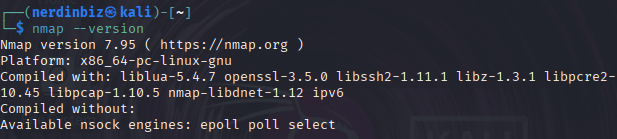
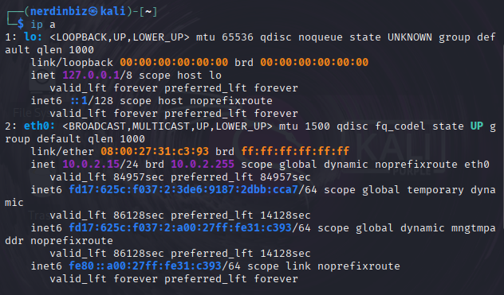
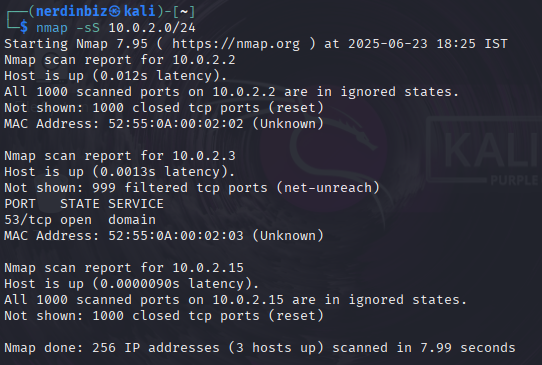

# 1. Installing NMAP

### I installed nmap on my kali linux virtual machine. Then I ran the command `nmap --version` to check and confirm whether nmap is installed or not.



---

# 2. Finding local IP range

### I found my local IP address using the command :

```bash
ip a
```

### Below is the output that I got :



### As we can see from the above image, my local IP address is :

```bash
10.0.2.15
```

---

# 3. Performing TCP SYN scan

### TO perform this scan, I used the command :

```bash
nmap -sS 10.0.2.0/24
```

### Below is the output that I got :



### As we can see from the above image, the scan is completed and it shows the open ports on the devices in my local network.

### IP addresses and ports found are:

```bash
10.0.2.2
```

-> All 1000 scanned TCP ports are closed.

```bash
10.0.2.3
```

-> Port 53/tcp (domain) is open.

```bash
10.0.2.15
```

-> All scanned TCP ports are closed.

---

# 4. Researching about common services running on those ports

### From the scan results, the only open port found was:

```bash
Port 53/tcp on 10.0.2.3
```

- Port Number: `53`
- Protocol: `TCP/UDP`
- Service: `DNS (Domain Name System)`

### By doing some research about the open port TCP 53, it may be a DNS server or a system running DNS-related services.

---

# 5. Identifing potential security risks from open ports.

### By doing some research I found that **Open ports are gateways into a device**.

### If unnecessary services are running and left exposed, they can be exploited.

### By doing some more research from the internet and ChatGPT, I found the below analysis of this scan :

- If misconfigured or vulnerable, it could be a target for:
  - DNS amplification attacks
  - DNS cache poisoning
  - Information leakage
- Other systems had all ports closed:
  - This is a good security posture. Fewer exposed services = smaller attack surface.

---

# 6. Saving scan results to a file

### I saved the scan results to a file using the command:

```bash
nmap -sS 10.0.2.0/24 -oN result.txt
```

### This saved the scan data to `result.txt `
