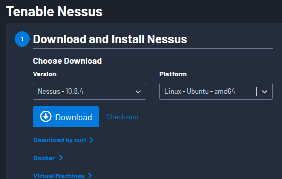
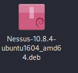
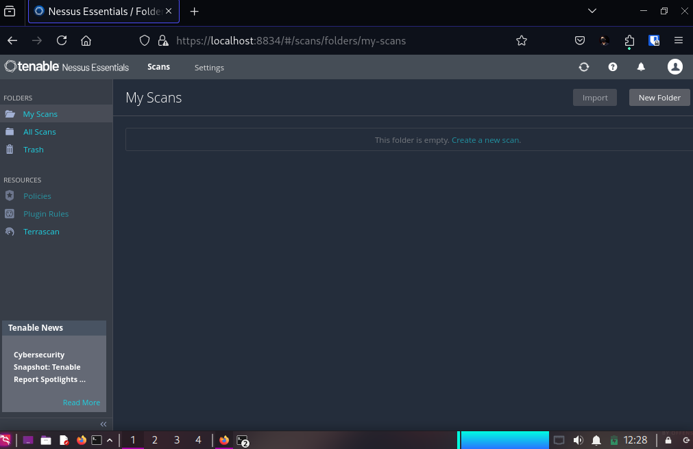
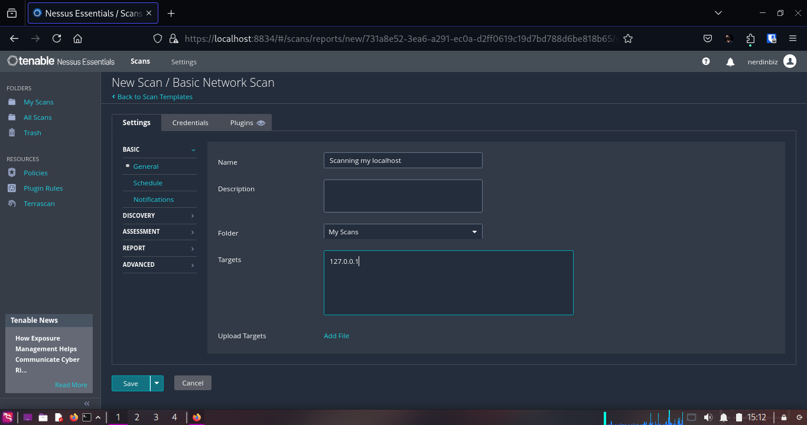
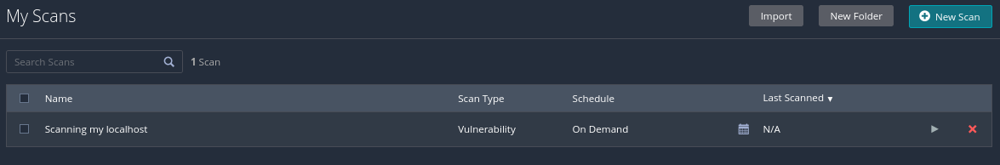
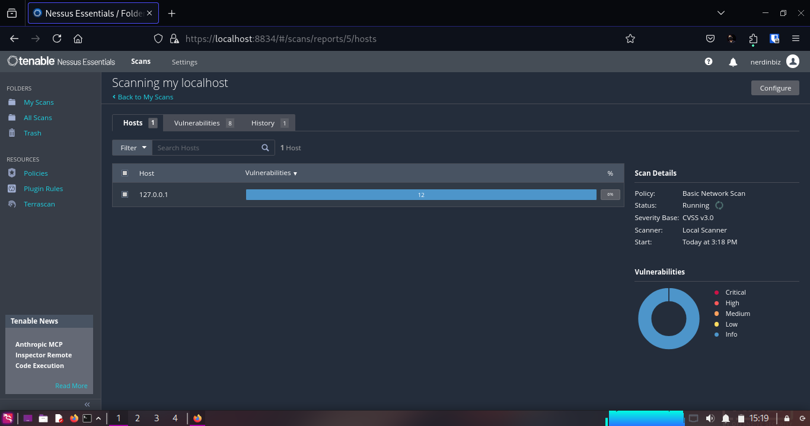
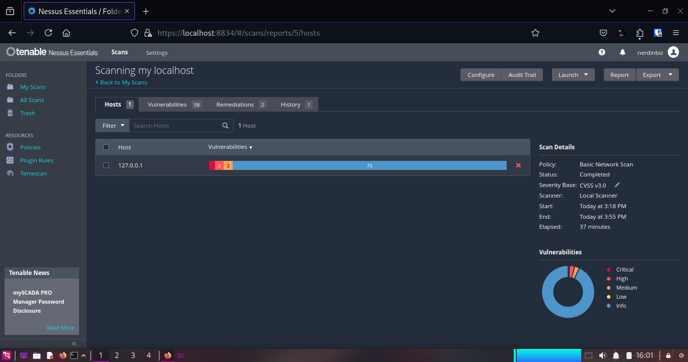
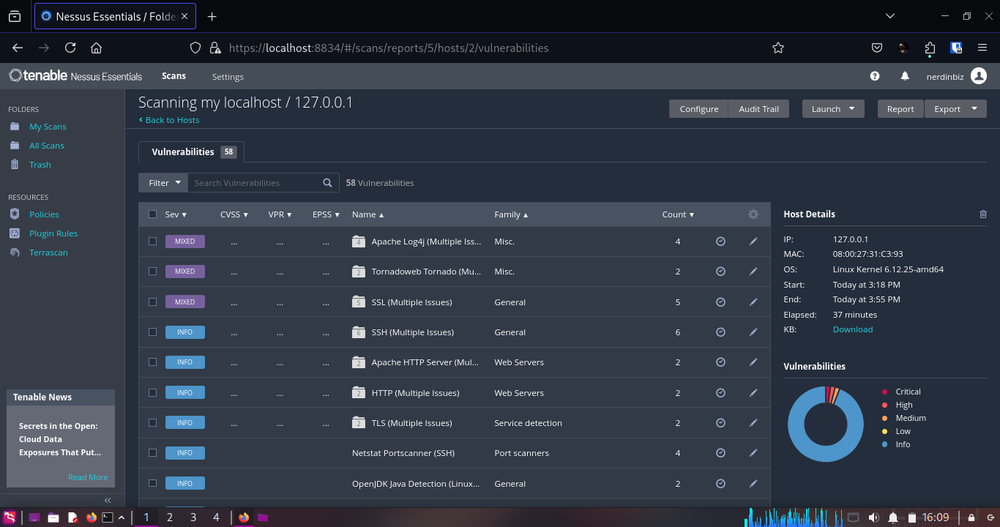

# 1. Installing Nessus Essentials

### For this task, I chose to use **Nessus Essentials** as my vulnerability scanning tool.

### I downloaded it from the official Tenable website:

[https://www.tenable.com/downloads/nessus](https://www.tenable.com/downloads/nessus)

### I'm using Kali linux in VM, so I selected the version for **Linux** and followed the installation instructions provided on the site.




### After downloading, I went through the installation instructions given on [https://docs.tenable.com/nessus/Content/InstallNessusLinux.htm](https://docs.tenable.com/nessus/Content/InstallNessusLinux.htm) and I installed the downloaded package using the following command:

```bash
sudo dpkg -i Nessus-10.8.4-ubuntu1604_amd64.deb
```

### I then started the Nessus service with:

```bash
sudo systemctl start nessusd
```

### Then I opened my web browser and navigated to `https://localhost:8834/` to access the Nessus web interface.

### I was prompted to create an account, so I filled in the required details and created a user account.

### After that, I was asked to enter an activation code. I obtained the activation code from the Tenable website after registering for Nessus Essentials.

### After doing all of this, I was able to log in to the Nessus web interface.



### Initially, Nessus took some time to update its plugins and configurations.

---

# 2. Setting Up the Vulnerability Scan

### Once Nessus was running on the web interface, I followed these steps:

1. Clicked "New Scan"

2. Selected "Basic Network Scan" option

3. Set target to my **localhost**:

```bash
127.0.0.1
```

4. Named the scan "Scanning my localhost"
   

5. Clicked "Save" to save the scan configuration

### Now, I am ready to run the scan.

### I clicked on the little play button to start the scan.



---

# 3. Running the Vulnerability Scan

### The scan started running, and I could see the progress in the web interface.



---

# 4. Reviewing the Scan Results

### After the scan completed, I clicked on the scan to view the results.



### The scan took approximately 37 minutes to complete.

- Nessus analyzed all reachable services, ports, and software.
- A total of 58 vulnerabilities were found.

### From the above screenshot, we can see the details of the vulnerabilities found during the scan.

- 1 critical vulnerability
- 2 high vulnerabilities
- 2 medium vulnerabilities
- 75 informational vulnerabilities



---

# 5. Documenting the most critical vulnerabilities.

### As this was my first vulnerability scan using Nessus, it was a bit confusing to navigate through the results. So, I exported the scan result and gave it to <u>ChatGPT</u> to analyze the critical and high-severity vulnerabilities.

### Below are the top issues detected:

### 🔴 Vulnerability #1: Apache Log4j SEoL (<= 1.x)

- **Severity:** Critical
- **CVSS Score:** 10.0
- **CVE:** N/A
- **Description:** Apache Log4j version ≤ 1.x is no longer supported. This means it will no longer receive security updates and may contain several unpatched vulnerabilities.
- **Risk:** Extremely dangerous due to its history of Remote Code Execution vulnerabilities.
- **Fix:** Upgrade to a currently supported version of Apache Log4j (2.17.1 or later).

---

### 🟠 Vulnerability #2: Apache Log4j 1.x Multiple Vulnerabilities

- **Severity:** High
- **CVSS Score:** 9.0
- **CVEs:**
  - `CVE-2019-17571`: RCE via deserialization
  - `CVE-2020-9488`: SMTPS MITM vulnerability
  - `CVE-2022-23302`: JNDI misconfiguration vulnerability
- **Description:** The version of Apache Log4j installed is vulnerable to multiple serious issues including RCE and data leakage.
- **Fix:** Upgrade Log4j to the latest version recommended by the Apache Foundation:  
  [https://logging.apache.org/log4j/2.x/security.html](https://logging.apache.org/log4j/2.x/security.html)

---

### 🟠 Vulnerability #3: Python Tornado 6.5.0 - Denial of Service (DoS)

- **Severity:** High
- **CVSS Score:** 7.8
- **CVE:** CVE-2025-47287
- **Description:** Tornado's multipart/form-data parser can be abused to flood the logs, causing Denial of Service. The logging subsystem being synchronous worsens the impact.
- **Fix:** Upgrade the Tornado Python package to version `6.5.0` or later.

---

### Based on the export, I also asked ChatGPT to make a scan-report which can be found here: [scan-report.txt](scan-report.txt)

---
