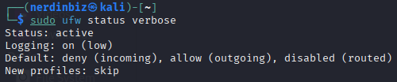
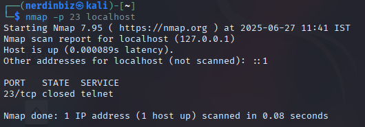

# Installing and Enabling UFW

### As I am using Kali Linux, I will install UFW using the following command:

```bash
sudo apt install ufw
```


### After installation, I will enable UFW using the command:

```bash
sudo ufw enable
```


- To know how to use UFW, I google "how to use UFW" and found the official documentation: [UFW Documentation](https://help.ubuntu.com/community/UFW)
- Following the documentation, I found multiple commands to use UFW.

### To check the status of UFW, I will use the command:

```bash
sudo ufw status verbose
```



---

# 2. Blocking Inbound Traffic on Port 23 (Telnet)

### A simple google search showed that port 23 is primarily used by the Telnet protocol for remote terminal access to devices.

### I will add a rule to block inbound traffic on port 23 using the command:

```bash
sudo ufw deny 23
```


### To verify that the rule has been added, I will check the status of UFW again:

```bash
sudo ufw status verbose
```


- The output confirms that inbound traffic on port 23 is blocked.

---

# 3. Testing the Rule

### To test the rule, I will use `nmap` to check whether port 23 is open or closed on the localhost:

```bash
nmap -p 23 localhost
```



- The output shows that port 23 is closed, confirming that the rule to block inbound traffic on port 23 is working as intended.

---

# 4. Allowing SSH on Port 22

### Since SSH is commonly used for remote access, I will allow inbound traffic on port 22 using the command:

```bash
sudo ufw allow 22
```


- At this point, I will create a export the firewall rules in a text file using the command:

```bash
sudo ufw status verbose > ufw_rules.txt
```

- Here is the text file containing the firewall rules: [ufw_rules.txt](ufw_rules.txt)

---

# 5. Removing the Test Rule

### Before removing the test rule, I'll list all current UFW rules:

```bash
sudo ufw status numbered
```


### To remove the rule blocking port 23, I will use the command:

```bash
sudo ufw delete 1
```

---

# 6. Summarizing How Firewall Filters Traffic

A firewall acts as a **barrier between a trusted system and untrusted networks**. It monitors incoming and outgoing traffic and applies rules to decide whether to **allow** or **block** specific connections.

How it works:

- **Inbound rules** control what traffic is allowed **into** the system (e.g., blocking Telnet on port 23).
- **Outbound rules** control what traffic can **leave** the system (e.g., preventing apps from accessing the internet).
- Firewalls filter traffic based on multiple parameters like:
  - **IP addresses**
  - **Port numbers**
  - **Protocols (TCP/UDP)**
  - **Application behavior**

In this task, I used **UFW (Uncomplicated Firewall)** which provides a simplified command-line interface to tweak firewall rules. By using basic commands, I was able to:

- Block an insecure service (Telnet)
- Allow essential services (SSH)
- View and manage rules dynamically
