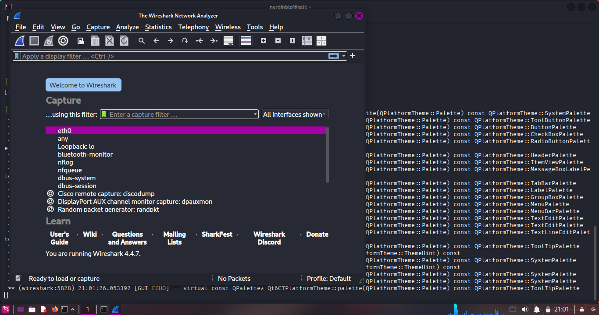

# Installing wireshark

### I installed Wireshark on my Kali Linux virtual machine using the following command:

```bash
sudo apt install wireshark
```


- Wireshark was already installed on my Kali Linux virtual machine, so I did not need to install it again.

## Starting Packet Capture

### I launched Wireshark and selected the active network interface:

```bash
wireshark &
```



- Selected the active network interface (usually `eth0` for wired or `wlan0` for wireless)
- Clicked "Start capturing packets" button


## Generating Network Traffic

### To **generate traffic** for analysis, ChatGPT suggested to performe the following activities:

1. **Web browsing traffic:**

```bash
curl -I https://www.google.com
curl -I https://github.com
```

2. **DNS queries:**

```bash
nslookup google.com
dig github.com
```

3. **Ping traffic:**

```bash
ping -c 5 8.8.8.8
ping -c 3 google.com
```


### From the above screenshot, I can see that I generated network traffic by performing web requests, DNS lookups, and ping commands.

### I let the capture run for approximately 1-2 minutes to collect sufficient data.

## Stopping Capture and Analysis

### I stopped the packet capture in Wireshark by clicking the red "Stop" button.

## Protocol Analysis

### I identified and filtered the following protocols:

### 1. **HTTP Traffic:**

```
http
```

- Found HTTP requests to various websites
- Observed GET requests and responses


- **applied the http filter** 👆

### 2. **DNS Traffic:**

```
dns
```

- Captured DNS queries and responses
- Identified A record lookups for domain names


- **applied the dns filter** 👆

### 3. **TCP Traffic:**

```
tcp
```

- Observed TCP handshakes (SYN, SYN-ACK, ACK)
- Connection establishment and teardown


- **applied the tcp filter** 👆

### 4. **ICMP Traffic:**

```
icmp
```

- Captured ping requests and replies
- Echo request/reply packets


- **applied the icmp filter** 👆

## Key Findings

### Summary of captured protocols:

- **Total packets captured:** 416 packets
- **HTTP packets:** 12 packets - Web traffic
- **DNS packets:** 15 packets - Domain name resolution
- **TCP packets:** 338 packets - Reliable connection-oriented traffic
- **ICMP packets:** 10 packets - Network diagnostic traffic

### Observations:

- Most web traffic uses HTTPS (port 443) rather than HTTP (port 80)
- DNS queries show both IPv4 (A records) and IPv6 (AAAA records) lookups
- TCP three-way handshake clearly visible in connection establishment
- **TCP represents the majority of captured traffic** (81.3% of total packets)
- **ICMP packets correspond to our ping commands** (10 packets from ping -c 5 and ping -c 3)
- **DNS traffic shows domain resolution** for google.com and other lookups
- **HTTP traffic captured from curl commands** and web requests

## Exporting Capture File

### I saved the packet capture as a .pcap file:

File > Export Specified Packets > Save as "network-traffic-analysis.pcap"


Access the file here: [network-traffic-analysis.pcap](network-traffic-analysis.pcap)
