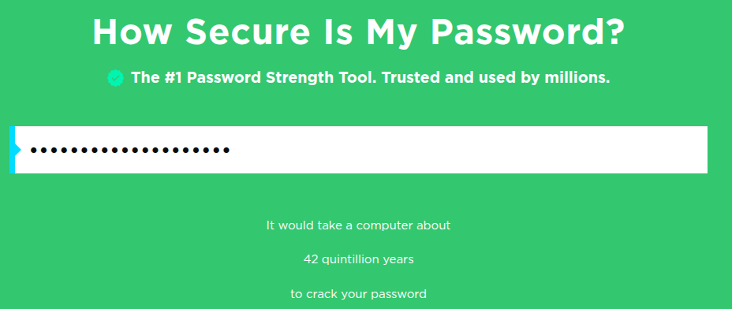

# Password Strength Analysis - Task 6

## Creating and Testing Strong Passwords

### Overview

In this task, I will create multiple passwords with varying complexity levels and test them using online password strength checkers to understand what makes a password strong and secure.

## Password Creation Process

### Test Password 1: Weak Password

```
Password: password123
```

### Test Password 2: Medium Strength Password

```
Password: MyPassword2024!
```

### Test Password 3: Strong Password

```
Password: Tr0ub4dor&3$ecur3!
```

### Test Password 4: Very Strong Password

```
Password: 9#mK8$pL2@vR5!qW7&nF
```

## Testing with Password Strength Checkers

### Tool 1: passwordmeter.com

I will test each password on [passwordmeter.com](https://passwordmeter.com/) and document:

- Overall score (percentage)
- Strength rating
- Specific feedback and recommendations

### Tool 2: security.org Password Checker

I will also test on [security.org/how-secure-is-my-password](https://www.security.org/how-secure-is-my-password/) for comparison and document:

- Security score
- Strength rating
- Detailed feedback

## Password Testing Results

### 1. Test Password 1: password123

- **Testing on passwordmeter.com:**


- **Testing on security.org:**


### 2. Test Password 2: MyPassword2024!

- **Testing on passwordmeter.com:**


- **Testing on security.org:**


### 3. Test Password 3: Tr0ub4dor&3$ecur3!

- **Testing on passwordmeter.com:**


- **Testing on security.org:**


### 4. Test Password 4: 9#mK8$pL2@vR5!qW7&nF

- **Testing on passwordmeter.com:**


- **Testing on security.org:**



## Results and Analysis

### Password Strength Comparison Table

| Password             | Length | Contains                       | PasswordMeter Score | Security.org Time to Crack | Strength Assessment |
| -------------------- | ------ | ------------------------------ | ------------------- | -------------------------- | ------------------- |
| password123          | 11     | lowercase, numbers             | 43% (Good)          | 1 month                    | Weak                |
| MyPassword2024!      | 15     | upper, lower, numbers, symbols | 100% (Very Strong)  | 15 billion years           | Very Strong         |
| Tr0ub4dor&3$ecur3!   | 18     | upper, lower, numbers, symbols | 100% (Very Strong)  | 7 quadrillion years        | Very Strong         |
| 9#mK8$pL2@vR5!qW7&nF | 20     | upper, lower, numbers, symbols | 100% (Very Strong)  | 42 quintillion years       | Very Strong         |

### Detailed Analysis

**Password 1 (password123):**

- **PasswordMeter:** 43% score, rated as "Good" but with significant weaknesses
- **Security.org:** Only 1 month to crack - extremely vulnerable
- **Issues:** Uses common dictionary word "password", predictable pattern, lacks complexity

**Password 2 (MyPassword2024!):**

- **PasswordMeter:** Perfect 100% score, rated as "Very Strong"
- **Security.org:** 15 billion years to crack - excellent security
- **Strengths:** Good length, mixed case, includes symbols and numbers

**Password 3 (Tr0ub4dor&3$ecur3!):**

- **PasswordMeter:** Perfect 100% score, rated as "Very Strong"
- **Security.org:** 7 quadrillion years to crack - exceptional security
- **Strengths:** Longer length, creative substitutions, multiple symbols

**Password 4 (9#mK8$pL2@vR5!qW7&nF):**

- **PasswordMeter:** Perfect 100% score, rated as "Very Strong"
- **Security.org:** 42 quintillion years to crack - maximum security
- **Strengths:** Maximum randomness, no patterns, optimal length and complexity

## Key Findings

### What Makes a Password Strong:

- **Length:** Longer passwords are exponentially harder to crack - evident from the jump from 1 month (11 chars) to 42 quintillion years (20 chars)
- **Character Variety:** Using uppercase, lowercase, numbers, and symbols dramatically improves security
- **Unpredictability:** Avoiding common words like "password" - even with numbers, it's still weak
- **Randomness:** The completely random password (9#mK8$pL2@vR5!qW7&nF) achieved maximum security

### Key Observations from Testing:

- **Dictionary Words are Fatal:** "password123" only took 1 month to crack despite being 11 characters
- **Length Matters Exponentially:** Adding just 4 more characters increased crack time from 15 billion to 7 quadrillion years
- **Perfect Scores Don't Mean Equal Security:** All three strong passwords got 100% on PasswordMeter, but crack times varied wildly
- **Tool Differences:** PasswordMeter focuses on composition rules, while Security.org estimates actual crack time

### Common Password Attacks:

- **Brute Force:** Trying all possible combinations - defeated by length and complexity
- **Dictionary Attack:** Using common words and passwords - "password123" vulnerable to this
- **Social Engineering:** Guessing based on personal information - avoided by using random characters

## Best Practices Learned

1. **Minimum Length:** Use at least 12-16 characters
2. **Character Mix:** Include all character types (upper, lower, numbers, symbols)
3. **Avoid Patterns:** Don't use keyboard patterns (qwerty) or simple substitutions (@ for a)
4. **Use Passphrases:** Consider memorable phrases with modifications
5. **Password Managers:** Use tools to generate and store unique passwords
6. **Regular Updates:** Change passwords periodically, especially for sensitive accounts

## Conclusion

Through testing different password complexities, I learned that password strength is not just about meeting minimum requirements, but about creating truly random, long, and complex combinations that resist modern attack methods.

The most secure approach is using a password manager to generate unique, complex passwords for each account while using a strong master password or passphrase.
