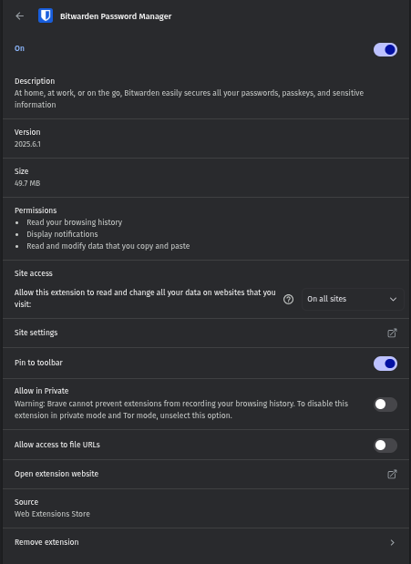

# Identifying & Removing Suspicious Browser Extensions - Task 7

### I use Brave Browser as my primary web browser, which is based on Chromium and supports Chrome extensions.

### I will open my browser's extension manager by navigating to `brave://extensions/` in the address bar.

### As you can see from the above screenshot, I have several extensions installed.

## Reviewing Installed Extensions

### By clicking on the "Details" button for each extension, I can see more information about them:

- 
- 
- 

### As I have alot of extensions installed, reviewing each one manually can be time-consuming, so I will only review the above three extensions for this task.

## Checking permissions and reviews:

### 1. **Bitwarden Password Manager**

- **Permissions:** Requires access to all websites, which is necessary for a password manager to fill in credentials.
- **Reviews:** Has a high rating (4.9 stars) with positive feedback
- **Conclusion:** Legitimate and necessary for security.

### 2. **Coinbase Wallet Extension**

- **Permissions:** Requires access to all websites, which is necessary for a wallet extension to function properly.
- **Reviews:** Has a high rating (4.8 stars) with positive feedback
- **Conclusion:** Legitimate and necessary for managing cryptocurrency.

### 3. **GoFullPage - Full Page Screen Capture**

- **Permissions:** Requires access to all websites, which is typical for a screen capture tool.
- **Reviews:** Has a high rating (4.7 stars) with positive feedback
- **Conclusion:** Legitimate and useful for capturing full web pages.

## Identifying Unused or Suspicious Extensions

### After reviewing the three extensions, I found that the **Coinbase Wallet Extension** is the only one that I do not use frequently. It was installed for a specific purpose but has not been used in a while.

### I have disable this extension to reduce potential security risks. I don not want to remove it completely in case I need it in the future, but disabling it will prevent it from running in the background and potentially exposing me to security risks.

## Research about how malicious extensions can harm users

### I did my small research about this using ChatGPT and other online resources. Here are some key points I found:

- **Data Theft:** Malicious extensions can steal sensitive information like passwords, credit card numbers, and browsing history.
- **Ad Injection:** Some extensions inject unwanted ads into web pages, degrading the user experience and potentially leading to phishing sites.
- **Browser Hijacking:** Extensions can change browser settings, redirecting users to malicious sites or changing the default search engine.
- **Resource Drain:** Malicious extensions can consume system resources, slowing down the browser and overall system performance.
- **Privacy Violations:** Extensions can track user behavior and collect data without consent, violating privacy policies.
- **Malware Distribution:** Some extensions can download and install malware on the user's system, leading to further security breaches.
- **Phishing Attacks:** Extensions can create fake login pages to trick users into entering their credentials, which are then sent to attackers.
- **Unauthorized Access:** Extensions can gain access to sensitive data and perform actions on behalf of the user without their knowledge, such as sending messages or making purchases.
- **Exploitation of Permissions:** Extensions often request broad permissions that can be exploited by attackers to gain access to sensitive data or perform unauthorized actions.
- **Social Engineering:** Malicious extensions can use social engineering tactics to trick users into granting permissions or installing additional malicious software.
- **Cross-Site Scripting (XSS):** Some extensions can inject malicious scripts into web pages, allowing attackers to steal data or perform actions on behalf of the user.
