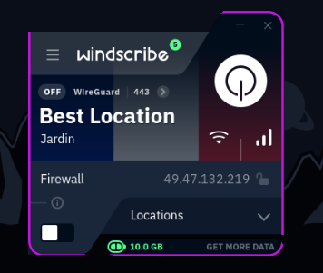
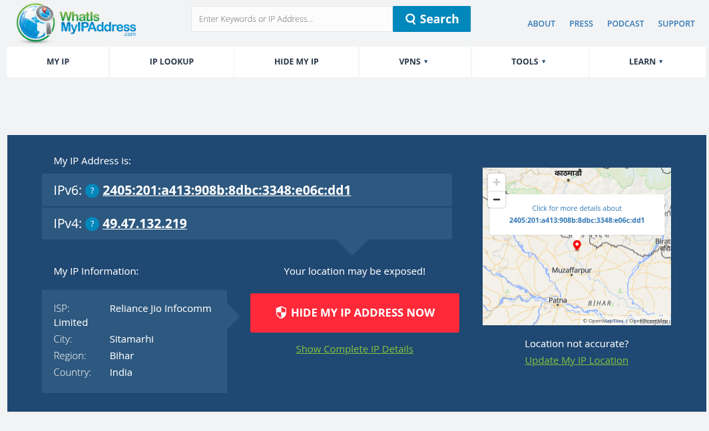
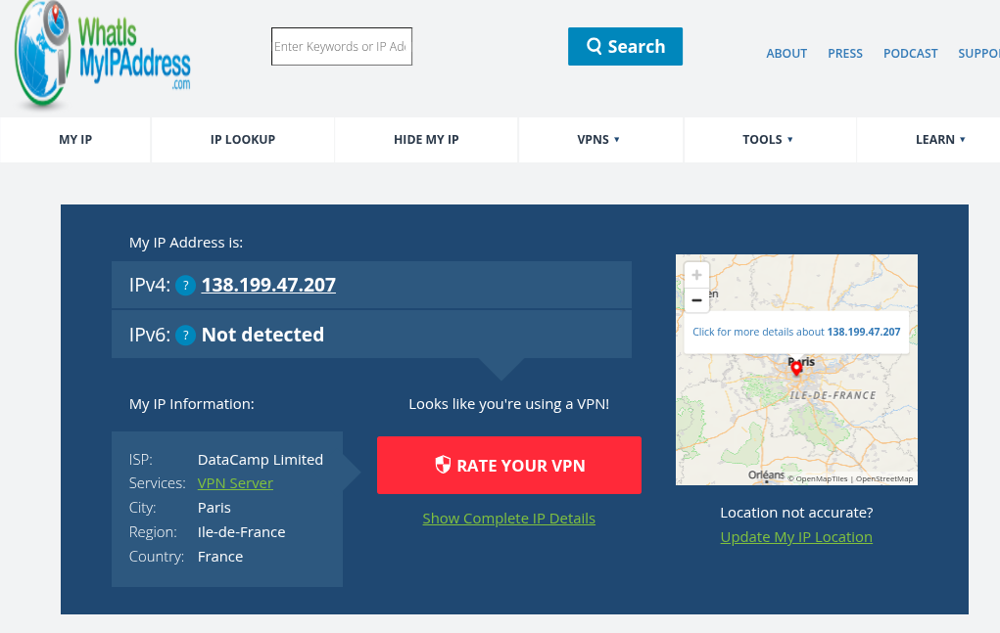

In this task, I will explore Virtual Private Networks (VPNs) by setting up a free VPN service, testing its functionality, and analyzing how it protects privacy and secures communication. I will document the setup process, verify the VPN connection, and research VPN benefits and limitations.

## VPN Service Selection

### Choosing a Free VPN Service

I will select a reputable free VPN service for this task. Popular options include:

- **ProtonVPN** (Limited GUI support on Arch Linux)
- **Windscribe** (Good CLI client for Linux)
- **TunnelBear** (AppImage available)

I will choose **[Windscribe](https://windscribe.com/)**, which will work perfectly on my Arch Linux system.

## VPN Setup Process

### Step 1: Account Registration

I will create my account on : https://windscribe.com/signup

After that, I will download the VPN client.

### Step 2: VPN Client Installation

I downloaded and installed the Windscribe client using the following command:

Then I logged in.

Now I am ready to connect to the VPN server.

### Step 3: VPN Connection Testing

I will test the VPN connection by:

- Connecting to a VPN server
- Verifying IP address change
- Testing connection stability

## VPN Verification and Testing

### Step 4: IP Address Verification

I will check my IP address by visiting [whatismyipaddress.com](https://whatismyipaddress.com/)

### **Before VPN Connection:**

- Original IP Address: **49.47.132.219**
- Location: **India**
- ISP: **Reliance Jio Infocomm Limited**

### Connecting to the VPN :

### **After VPN Connection:**

- New IP Address: **138.199.47.207**
- Location: **France**
- ISP: **DataCamp Limited**

## VPN Analysis and Research

### VPN Benefits

1. **Privacy Protection:**

   - Hides real IP address from websites
   - Prevents ISP tracking of browsing habits
   - Protects against location-based tracking

2. **Security Enhancement:**

   - Encrypts internet traffic
   - Protects on public Wi-Fi networks
   - Prevents man-in-the-middle attacks

3. **Geographic Freedom:**
   - Access geo-restricted content
   - Bypass regional censorship
   - Change apparent location

### VPN Limitations

1. **Performance Impact:**

   - Reduced internet speed due to encryption overhead
   - Increased latency from routing through VPN servers
   - Potential connection instability

2. **Free Tier Restrictions:**

   - Limited data allowance
   - Fewer server locations
   - Potential speed throttling
   - Limited simultaneous connections

3. **Privacy Considerations:**
   - VPN provider can potentially log activity
   - Not all VPN providers are trustworthy
   - Legal jurisdictions affect privacy protection

### Security Considerations

**VPN vs. No VPN Scenarios:**

| Scenario                | Without VPN                 | With VPN                           |
| ----------------------- | --------------------------- | ---------------------------------- |
| Public Wi-Fi            | Vulnerable to eavesdropping | Traffic encrypted                  |
| ISP Monitoring          | ISP sees all traffic        | ISP only sees VPN connection       |
| Website Tracking        | Real IP exposed             | VPN IP shown                       |
| Geographic Restrictions | Location-based blocking     | Can appear from different location |

## Best Practices Learned

1. **Choose Reputable VPN Providers:** Research privacy policies and logging practices
2. **Verify VPN Functionality:** Always test IP address change and leak protection
3. **Understand Performance Trade-offs:** VPNs reduce speed but increase security
4. **Use VPNs on Public Networks:** Essential for security on untrusted networks
5. **Consider Paid vs. Free:** Free VPNs have limitations that paid services address

## Conclusion

Through hands-on VPN setup and testing, I gained practical understanding of how VPNs work, their benefits for privacy and security, and their limitations. VPNs are valuable tools for protecting online privacy, especially on public networks, but users should understand the performance trade-offs and choose providers carefully.

The experience demonstrated that while VPNs significantly enhance privacy and security, they require careful selection and configuration to be effective.
